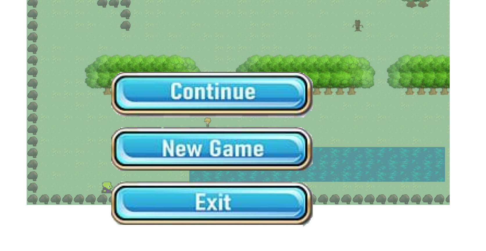

Wyświetlenie podstawowego okna i utowrzenie klasy pleyer 18.09.2023  

Wyświetlanie gracza i bosa oraz poruszanie się na podstawie klawiatury 22.09.2023 

Wyświetlenie obiektu który ma kolizję z garczem 23.09.2023  

Przekonwertownaie całego kodu na OOP 24.09.2023  

Wyświetlanie grupy obiektów mających kolizję z graczem 28.09.2023 

Wyświetlanie grupy obiektów które nie mają kolizji z graczem (tło) 5.10.2023 

Stworzenie grafiki oraz dodanie animacji chodzenia 10.10.2023  

Stworzenie większej mapy 15.10.2023  

Stowrzenie kamery 18.10.2023  

Optymalizacja związana z rysowaniem 20.10.2023  

Poprawa kodu 24.10.2023  

Stworzenie rzeki razem z animacjami 27.10.2023  

Optymalizacja kamery (liczenie tylko ekranu zamiast cąłej mapy) 3.11.2023  

Stworzenie minigierki opartej na snake ale z zaprogramowanym rywalem 5.11.2023  

Stworzenie dialogów związanych z interakcjami z elemantami 10.11.2023

Połączenie głównej gry z drugą minigierką i obsłużenie eliminacji obiektów związanych z bosami na głownej mapie 13.112023  

Dodanie wszystkich podstawowych funkcji do bossfight'u 18.11.2023  

Stworzenie efektu przysłaniania obiektów przez gracza lub garcza przez obiekty w zależności od pozycji 19.11.2023  

Obsłużenie ataków, animacji w zabijanie wrogów 20.11.2023   

Stworzenie skrzyni oraz animacji zdobywania broni 21.11.2023  

Poprawa interakcji z rzeką 26.11.2023  

Dodanie możliwości ataku i znikania w Bossie 01.12.2023  

Poprawa kodu, połączenie repozytoriów oraz dodanie grafik 04.12.2023  

Dodanie particli oraz efektu otrzymywania obrażeń od bosa 08.12.2023  

Dodanie ataków jednego z bosów oraz głupich efektów dźwiękowych 12.122023   

Dodanie nowych ataków do boss'a 13.12.2023  

